# Spotify Dataset Analysis
This project explores the factors that contribute to a song's popularity on Spotify using a dataset of audio features and metadata. By comparing popular and less-popular tracks, we aim to identify the characteristics most associated with success on the platform.

## Problem Statement
### What makes a song popular on Spotify?
#### In this project, I aim to investigate which audio features (like danceability, energy, or tempo) are most correlated with high popularity scores and how these traits have evolved over time.

## Dataset
- Source: [Kaggle](https://www.kaggle.com/) - [Spotify Tracks Dataset](https://www.kaggle.com/datasets/yamaerenay/spotify-dataset-19212020-600k-tracks): tracks.csv
- Fields Used:
    - `popularity`
    - `danceability`
    - `energy`
    - `valence`
    - `tempo`
    - `acousticness`
    - `loudness`
    - `release_date`

## Data Cleaning
- Converted `popularity` to numeric and removed rows with missing values.
- Converted `release_date` to a datetime format and extracted the year for time-based analysis.

## Exploratory Data Analysis (EDA)
### 1. Popular vs. Unpopular Songs
#### Bar chart comparing average audio features of popular (popularity > 80) and unpopular songs:

#### a.) Comparing Danceability
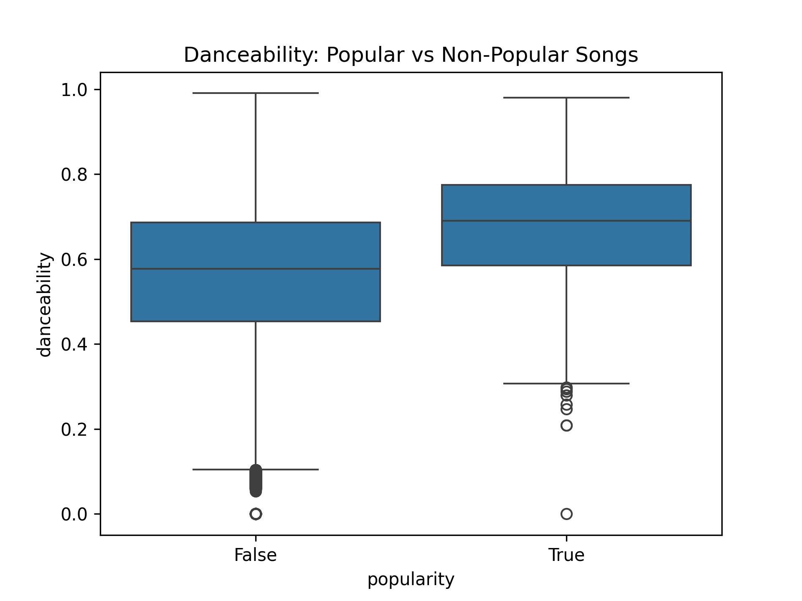
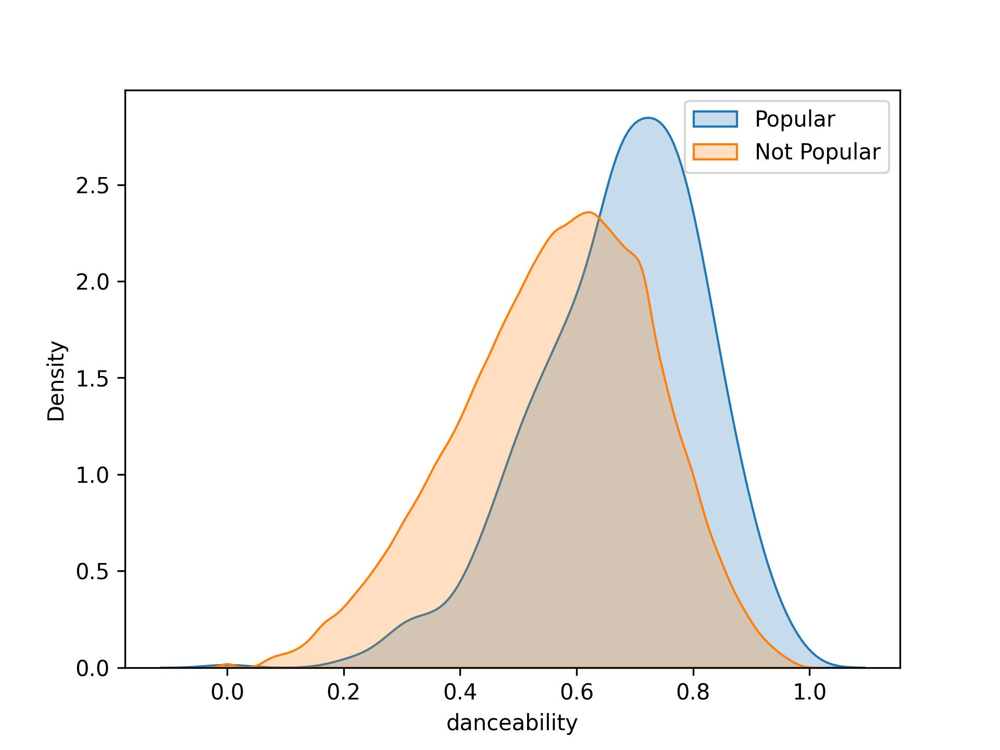

#### b.) Comparing Energy
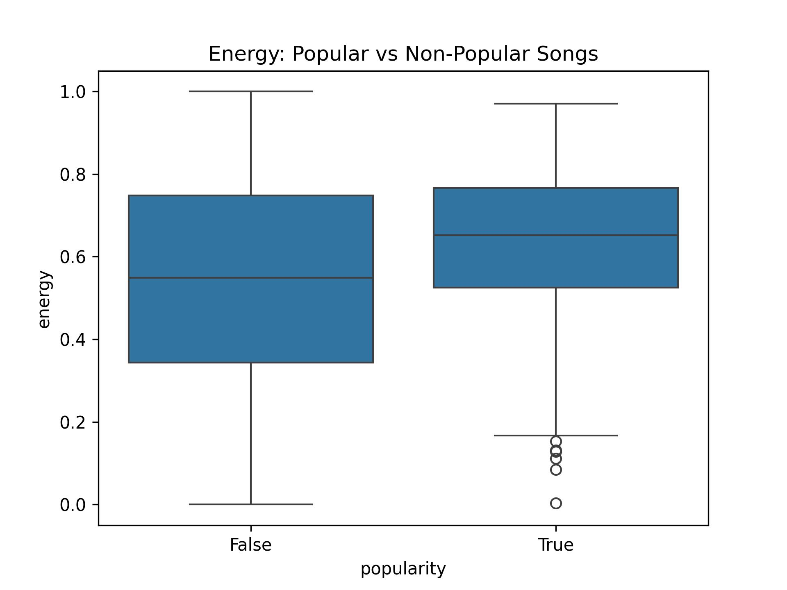
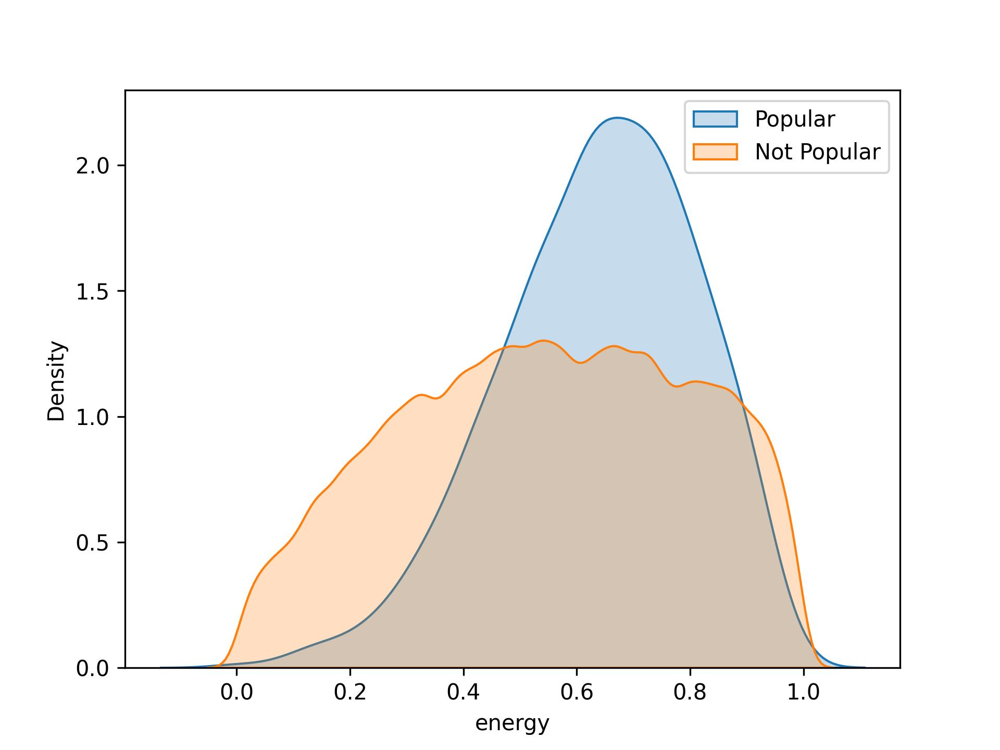

#### c.) Comparing Valence (emotional positivity or negativity)
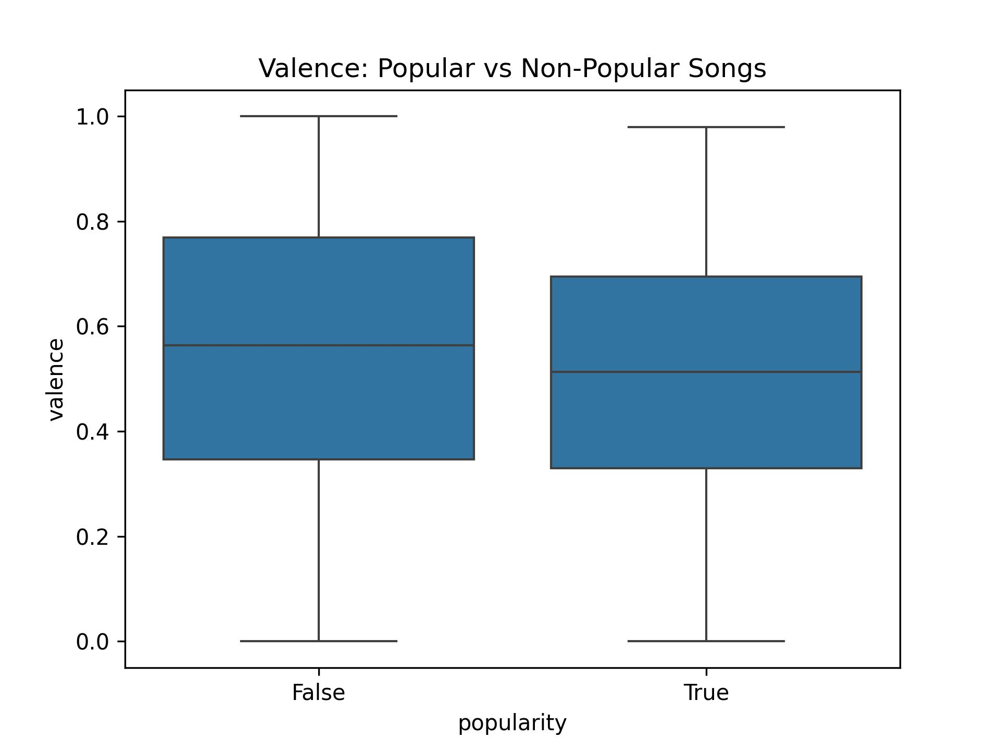
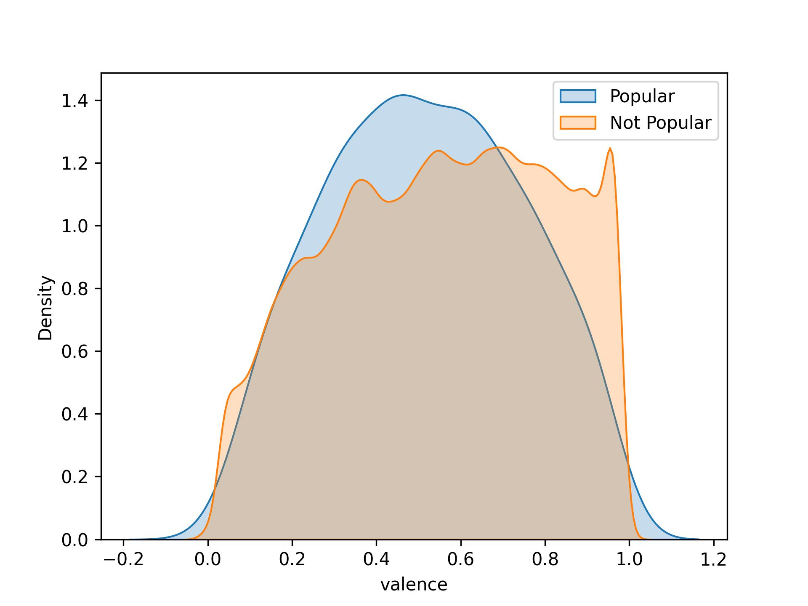

#### d.) Comparing Tempo
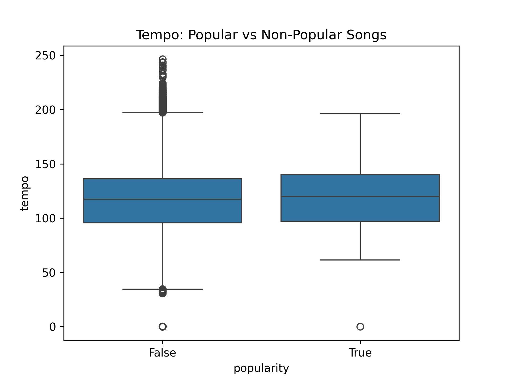
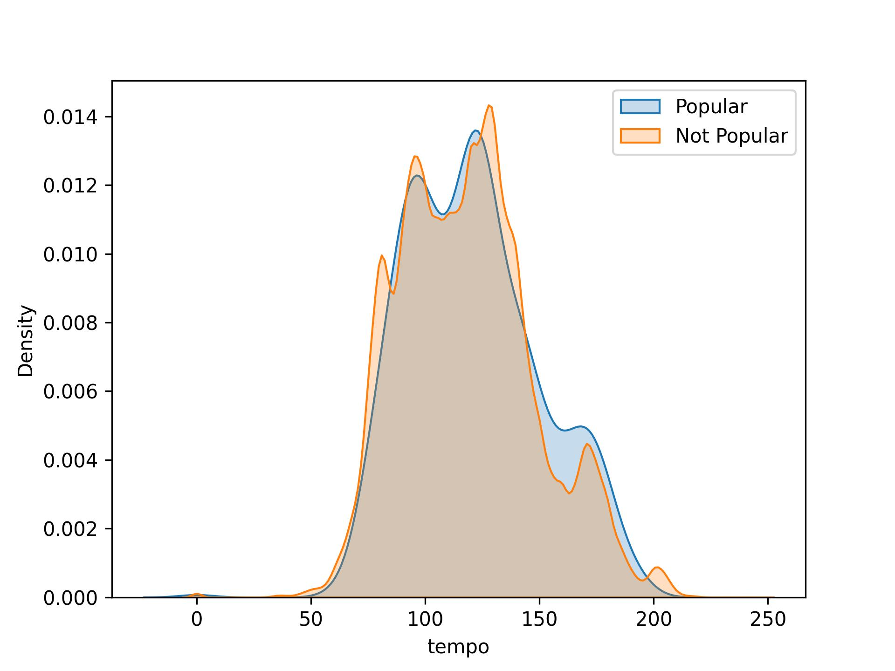

#### e.) Comparing Acousticness
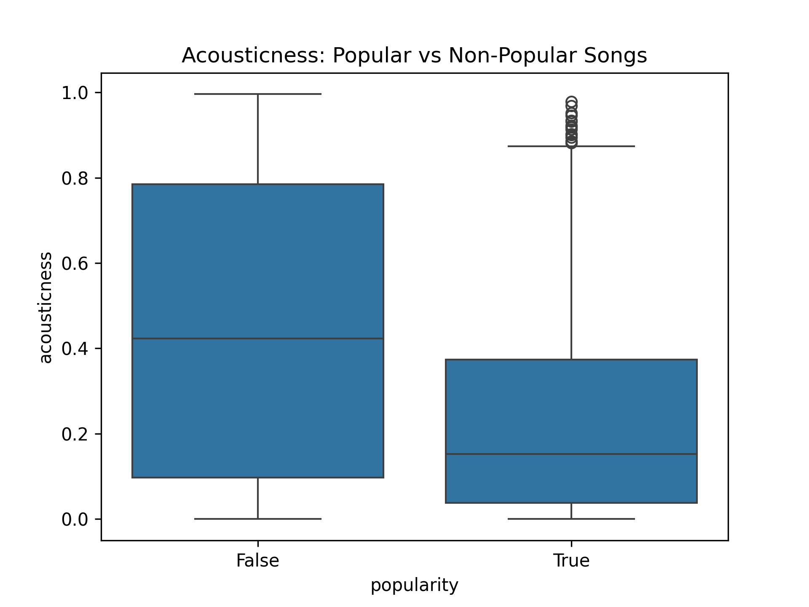
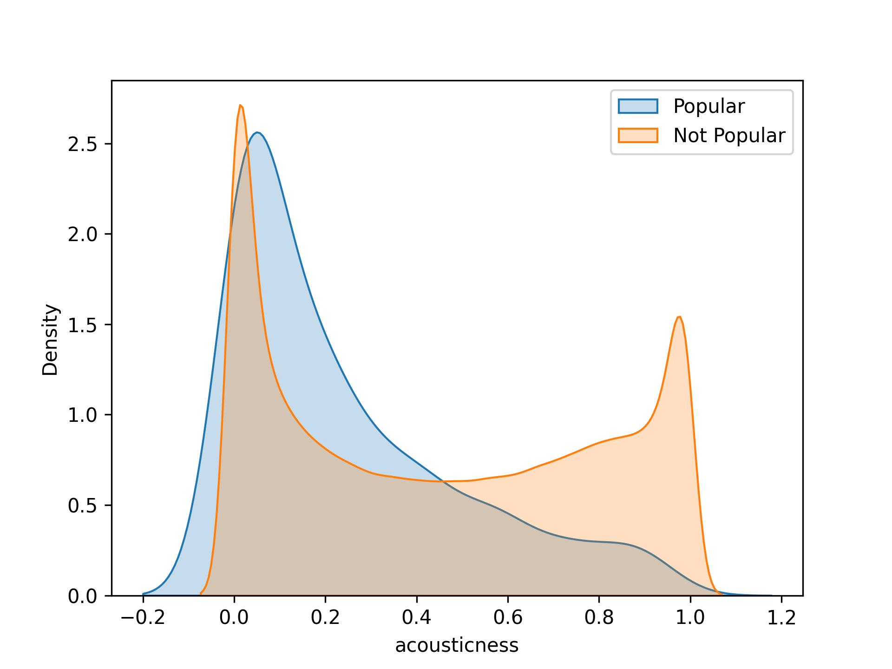

#### f.) Comparing Loudness
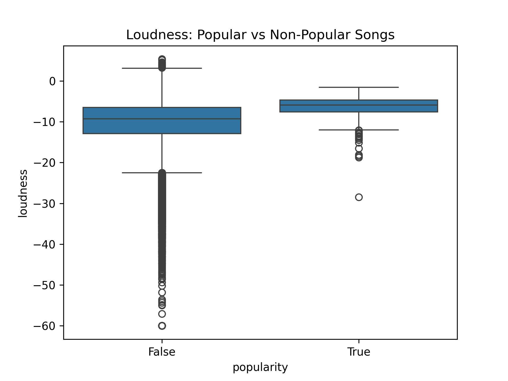
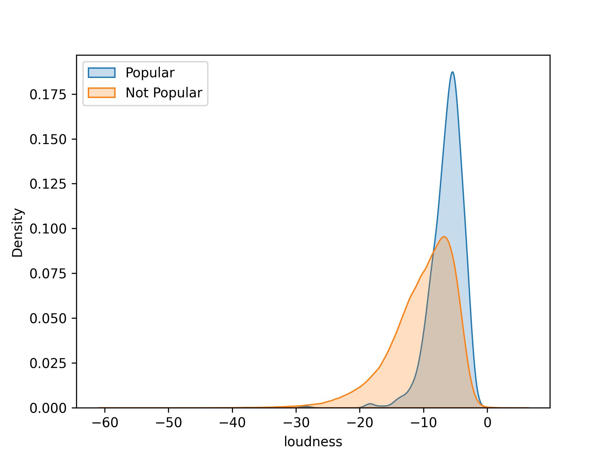

### 2. Trends Over Time
#### Line plots showing how key audio features and popularity have evolved over the years:
(need to attach)

## Key Findings
- Popular songs tend to have higher energy and danceability.
- Acousticness is lower in popular songs.
- Trends show a gradual increase in tempo and valence over the years.

## Next Steps
- Explore artist-level or genre-level trends.
- Use machine learning to predict popularity.
- Integrate additional metadata like genre or lyrics.

## Technologies Used
- Python (Pandas, Matplotlib, Seaborn)
- Jupyter Notebook / VSCode
- CSV data format
